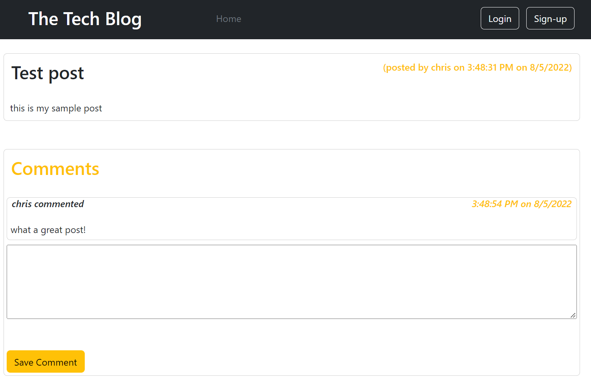

# 14 Model-View-Controller (MVC): Tech Blog

[Live site deployment](https://quiet-waters-34004.herokuapp.com/)

## Table of Contents
- [Description](#description)
- [Visuals](#visuals)
- [Usage](#usage)

## Description
This is the solution JavaScript for the 02-Challenge assignment in the 14 MVC Module.

The purpose of the assignment was to create a tech blog, using MVC structure, with MySQL, Handlebars, and Sequelize.  Heroku and JAWSDB are used for the live deployment.  The tech blog allows users to be created, posts to be made, and comments be attached to the posts.  Posts and threads are displayed.

## Usage 
This program is deployed on Heroku, at the following URL: https://quiet-waters-34004.herokuapp.com/.

## Installation Instructions
This program has has dependencies, and requires their installation via *npm*.  This project has a server component that can be invoked via Node at the command prompt using *npm start* or *nodemon*.

## Visuals
### The program in operation
